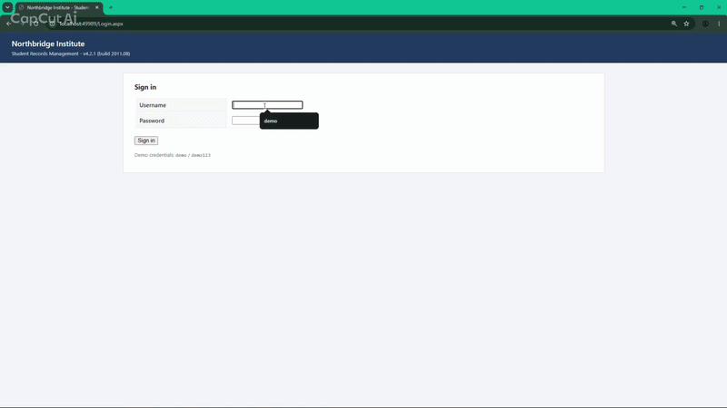
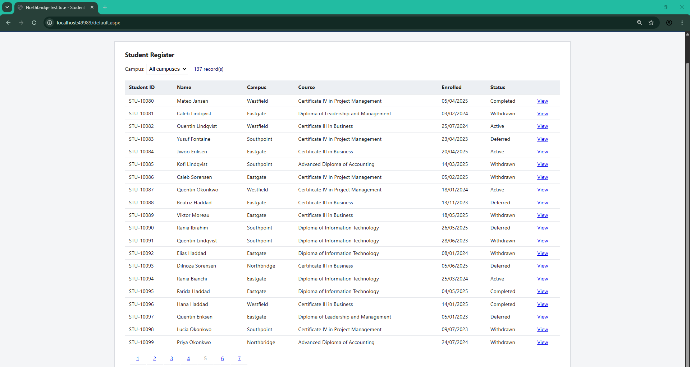
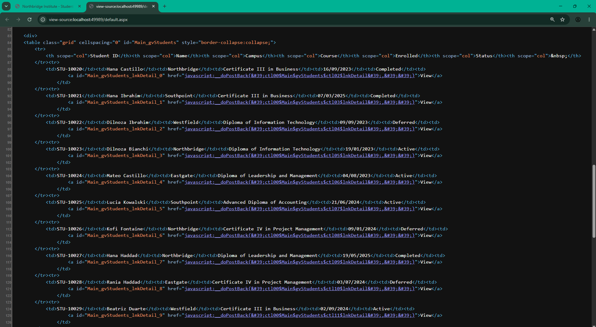

# webforms-scraper

[](https://github.com/dmasifur/webforms-scraper/actions/workflows/ci.yml)
[](LICENSE)

Scraping a legacy ASP.NET WebForms application — the kind with no usable URLs, MAC-validated ViewState, and control IDs that change every time the grid rebinds.

This repository contains **both halves**: a WebForms application I wrote and own, and a production-grade Python scraper that extracts every record from it into Excel.



## Why this is hard

Most scrapers assume you can walk URLs. WebForms doesn't work that way. Every navigation is a `POST` back to the same address, carrying encrypted state that the server validates before it will do anything.

Here's page 5 of the grid. Note the address bar:



There is no `?page=5` to iterate. To reach that page you have to replay a form submission the server considers valid — which means carrying its state correctly.

And the controls you need to target look like this:



`ctl00$Main$gvStudents$ctl02$lnkDetail`. That ID is generated from the control's position in the page hierarchy, and it **shifts whenever the grid rebinds** — change the campus filter and every row's ID moves. Hardcode one and your scraper breaks on the next run.

| What the application does | Why a naive scraper fails |
| --- | --- |
| Pagination via `__doPostBack`, not query strings | There is no URL to iterate |
| `__VIEWSTATE` and `__EVENTVALIDATION`, MAC-validated | Reused, fabricated, or stale tokens are rejected outright |
| Generated IDs like `ctl00$Main$gvStudents$ctl02$lnkDetail` | Hardcoded targets break on the next rebind |
| Forms authentication | Session cookie *and* valid tokens both required |
| Server-side filtering via an `AutoPostBack` dropdown | A third, distinct postback shape |
| Detail records held in `Session`, not the URL | Records cannot be enumerated directly |

## The result

`output/students.xlsx` — 137 unique student records, each merging fields from the list grid with fields that only exist on the individual detail page (email, phone, date of birth, address, emergency contact). Produced by a single command against a login-protected site.

`output/run.log` is the actual log from that run, committed as-is.

## How it works

Three ideas carry most of the weight.

**Every field gets echoed back.** WebForms expects the entire form returned on each postback — hidden tokens, text inputs, checked boxes, selected options — not just the field you changed. Anything missing or altered fails validation. `extract_form_fields()` rebuilds the complete payload from the current page, deliberately excluding submit buttons, since a button's presence in the payload is what tells the server it was clicked.

**Targets are resolved fresh, never hardcoded.** Each grid row carries its own postback target, read from that row's own `<tr>`. The pager's target and its `Page$N` argument are read from the same anchor, so the two halves cannot disagree. Nothing is stored between requests.

**Parsing is separated from transport.** `forms.py` and `parse_pages.py` never touch the network — they only take HTML strings. That's what lets the test suite run against real captured pages in CI with no server involved.

## Running it

Requires [uv](https://docs.astral.sh/uv/) and, for the demo application, Windows with .NET Framework 4.8.

**Start the target application.** Open `demo-app/` in Visual Studio (File → Open → Web Site) and press F5. It runs on IIS Express; no NuGet packages, no build step. Credentials are `demo` / `demo123`.

**Run the scraper:**

```bash
uv sync --all-extras --dev
export WEBFORMS_BASE_URL="http://localhost:51286"   # match the port IIS Express assigned
uv run python -m scraper.scrape_students
```

Output lands in `output/students.xlsx` and `output/run.log`.

| Variable | Default | Purpose |
| --- | --- | --- |
| `WEBFORMS_BASE_URL` | `http://localhost:51286` | Where the target application is running |
| `WEBFORMS_USERNAME` | `demo` | Forms auth username |
| `WEBFORMS_PASSWORD` | `demo123` | Forms auth password |
| `WEBFORMS_OUTPUT_PATH` | `output/students.xlsx` | Workbook destination |
| `WEBFORMS_DELAY_SECONDS` | `1.0` | Delay between requests |

The default one-second delay is deliberate. A full run takes a few minutes; that's the correct trade against hammering a server you don't own.

**Tests:**

```bash
uv run pytest
```

The suite runs entirely against captured HTML in `tests/fixtures/` — no server required, which is why it works in CI.

## What broke, and why

Three bugs surfaced only against the live server. They're worth writing down, because they're the ones that make WebForms scraping genuinely different from ordinary HTTP work — and each has a test guarding it now.

**The login silently did nothing.** `extract_form_fields()` excludes submit buttons by design, so `ctl00$Main$btnLogin` never reached the server. Without it, ASP.NET has no reason to invoke the button's click handler, so it just re-rendered the login page. The scraper read that as "invalid credentials." The fix was to re-add the button explicitly during login only — the one case where you *do* want to say a button was clicked.

**Row targets desynced from row data.** The grid parser accepted any `<tr>` with seven `<td>`s, while postback targets were collected in a separate pass over the whole page. Nothing guaranteed the two lists lined up, and an off-by-one produced an index error. Fixed by having each row extract its own target from its own `<tr>`, so there are no two lists to align.

**`Invalid postback or callback argument` on pagination.** The pager's target, `ctl00$Main$gvStudents`, was correctly resolved and then passed back through a *substring* lookup — where it matched `ctl00$Main$gvStudents$ctl02$lnkDetail`, a row link, first. The server received a row's LinkButton paired with a `Page$2` argument, a combination never registered, and event validation rejected it with a 500. The fix was to stop re-resolving something already resolved.

The pattern in all three: WebForms fails loudly on state it doesn't expect, and quietly on state it merely finds incomplete. The quiet failures cost more time.

## Repository layout

```
demo-app/          ASP.NET WebForms 4.8 target application (C#, no dependencies)
scraper/           Python client, parsers, and the scrape job
tests/             Test suite and captured HTML fixtures
output/            Committed results from a real run
docs/              Screenshots and recording
```

## Scope and legality

The application in `demo-app/` is written by me and owned by me. It exists so this repository can demonstrate the technique without touching anyone else's system. Its data is synthetic, generated from a fixed seed — 137 records, no real people.

These techniques are for systems you own or are authorised to access.

## A note on `<machineKey>`

`demo-app/Web.config` commits an explicit `machineKey`. That's deliberate: it makes ViewState MAC behaviour reproducible across machines, so the scraper's token handling can be verified consistently. **Never commit a machine key in a real deployment.**

## Licence

MIT — see [LICENSE](LICENSE).